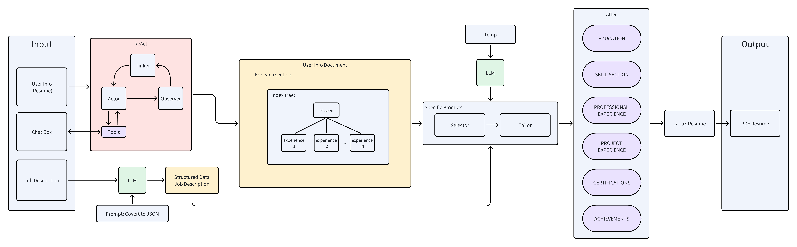

# Resume Tailor Using Large Language Model 

[](./resources/chat_resume_structure.png)


## 2. Setup, Installation and Usage

### 2.1. Prerequisites

 - **CPU: Intel i7 or above**
 - OS : Windows, Linux, Mac
 - Python : 3.9.18
 - LLM API key: [OpenAI](https://openai.com/pricing) 

### 2.4. Setup & Run Code - Use as Project
 1. Create and activate python environment to avoid any package dependency conflict.
    ```bash
    conda create -n job-llm python=3.11.6
    conda activate job-llm
    ```

 2. Install all required packages.
    - Try pip install
      ```bash
      pip install -r requirements.txt
      ```

3. We also need to install following packages to conversion of latex to pdf
    - For windows
   
        https://blog.csdn.net/qq_44319167/article/details/124648861?ops_request_misc=%257B%2522request%255Fid%2522%253A%2522170900683216800226543103%2522%252C%2522scm%2522%253A%252220140713.130102334..%2522%257D&request_id=170900683216800226543103&biz_id=0&utm_medium=distribute.pc_search_result.none-task-blog-2~all~top_positive~default-1-124648861-null-null.142%5Ev99%5Epc_search_result_base2&utm_term=TeX%20Live&spm=1018.2226.3001.4187
    - For linux
        ```bash
        sudo apt-get install texlive-latex-base texlive-fonts-recommended texlive-fonts-extra
        ```
        NOTE: try `sudo apt-get update` if terminal unable to locate package.
    - For Mac
        ```bash
        brew install basictex
        sudo tlmgr install enumitem fontawesome
        ```
4. download Llama and enable BigDL optimize
    ```bash
    cd ./resume_tailor 
    python download_Llama2_and_BigDL_optimize.py
    cd ../
    ```

5. Run the resume_tailor tool
```bash
>>> python main.py /
    --url "JOB_POSTING_URL" /
    --master_data="JSON_USER_MASTER_DATA" /
    --api_key="YOUR_LLM_PROVIDER_API_KEY" / # put api_key considering provider
    --downloads_dir="DOWNLOAD_LOCATION_FOR_RESUME_CV" /
    --provider="BigDL-Llama-2-7b-chat" # BigDL-Llama-2-7b-chat, gpt-3.5-turbo-0125, gpt-4-1106-preview, gemini-pro
```
6. Run app
```bash
streamlit run web_app.py
```